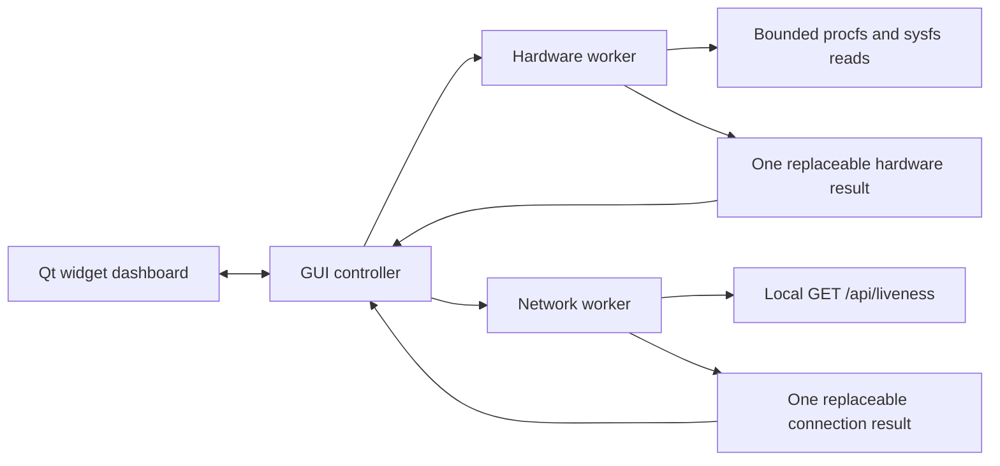

# Architecture

Unsloth Monitor is a manually launched Python/PySide6 application built with
native Qt widgets. The first implementation targets Linux x86_64. The shared
interface can execute on the Windows development host, but Windows hardware
collection is explicitly unsupported.

## Responsibilities

| Module | Responsibility |
| --- | --- |
| `metrics.py` | Shared readings and snapshots: value, unit, source, timestamp, explicit availability |
| `collectors/` | Platform selection and Linux discovery/collection; no Qt or network dependency |
| `integration/client.py` | Validated local endpoint, bounded passive HTTP, response classification |
| `polling.py` | One worker thread and one replaceable result slot per source |
| `app.py` | Lifecycle, configuration revision, refresh policy, stale readings, process lock |
| `settings.py` | Bounded preference loading and replacement of non-secret preferences |
| `ui/dashboard.py` | Native widgets, formatting, source tooltips, settings dialog |

The hardware collector runs independently of network access. Neither collector
runs on the GUI thread. No web server, browser runtime, ML framework, model load,
GPU compute context, proxy, inference request, or inference log reader is part
of the application. See [hardware semantics](HARDWARE.md) and the
[telemetry contract](TELEMETRY.md) for exactly what each adapter reads.

## Polling and retained state

Both workers start immediately. The default interval is five seconds **after
the preceding collection completes**, so the observed interval includes work
duration. Settings offer 2, 5, 10, or 15 seconds. Failed network polls back off to
30 seconds; at the default interval the waits are 5, 10, 20, then 30 seconds.
Each HTTP poll has a two-second overall budget. Allow up to roughly 30 seconds
plus two seconds of request time and 0.5 seconds for visible UI consumption when
detecting a service that starts during backoff. These are scheduler expectations,
not an end-to-end measurement on the user's installation.

A worker never overlaps its own polls. Refresh requests coalesce in an event;
there is no unbounded task queue. Its single result slot replaces unread results.
Discovery and static hardware identity are cached. Only current readings and
the last displayed snapshots are retained; no history, graphs, sample database,
or periodic sample log is maintained.

Minimizing sets both collection intervals to 30 seconds and suppresses dashboard
updates. The controller timer slows from 0.5 to five seconds. Restoring the window
wakes both workers for a new sample and consumes any retained result without
resetting its observation age. There are no hidden animations or tray mode.

Available hardware values become stale after `max(15, 3 × visible interval)`
seconds without a fresh snapshot. A connection snapshot older than 40 seconds
becomes a stale connection check and clears displayed telemetry. A failed
connection result likewise supplies explicit unavailable fields. Configuration
revisions prevent an old request from overwriting a newly selected endpoint.

## Launch, shutdown, and preferences

Qt's configuration directory holds only endpoint/refresh preferences and a
`QLockFile` process lock. Normal launches sharing that directory cannot create a
second instance. `--config-dir` deliberately permits isolated validation runs.
Bearer tokens remain session-only; response bodies and raw exception strings
are not displayed or logged. Preference files have an 8 KiB load limit. Writes
replace a temporary file, and a save failure still permits session-only changes.

Closing the window stops both workers, wakes their polling waits, waits
asynchronously for cleanup, then closes the window and releases the process
lock. The UI remains responsive during this wait. The final cleanup joins both
threads; there is no intentional orphan or hidden background mode. No startup
entry, scheduled launch, system service, driver installation, or hardware-setting
write is created.

Network collection is bounded. Linux driver-backed file reads have no general
userspace timeout: a broken driver can leave a hardware worker blocked in a
kernel read. The window remains responsive, but clean shutdown can then wait
indefinitely. This residual risk has not been reproduced or excluded on the
target computers; process isolation would need evaluation if it occurs.
