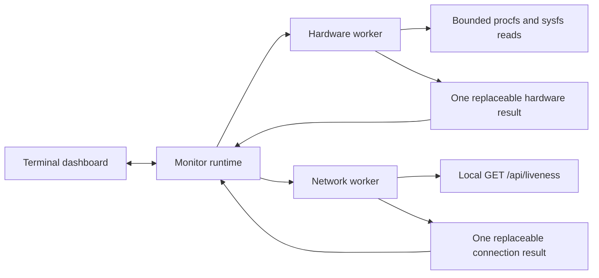

# Architecture

Unsloth Monitor runs **inside the user's normal terminal**. This follows the
user's later clarification and supersedes the original Qt-window requirement.
Python curses controls text placement and keyboard input; the terminal emulator
supplies its existing font, foreground, background, and transparency. The app
defines no color pairs or fixed theme and starts no terminal emulator itself.

## Responsibilities

| Module | Responsibility |
| --- | --- |
| `metrics.py` | Reading value, unit, source, observation timestamp, and availability |
| `collectors/` | Platform selection and Linux hardware collection |
| `integration/client.py` | Validated loopback endpoint, bounded passive HTTP, response classification |
| `polling.py` | One thread and one replaceable result slot per source |
| `runtime.py` | Hardware/network coordination, configuration revision, quiet policy, stale state, cleanup |
| `terminal.py` | Pure bounded renderer, curses view, keyboard settings and source details |
| `settings.py` | Bounded loading and replacement of non-secret preferences |
| `instance.py` and `app.py` | Linux process locking, manual launch, signal handling, terminal lifecycle |

Hardware and network collection run independently, off the terminal input loop.
No Qt, browser, web server, ML framework, GPU compute context, proxy, model load,
or inference request is part of the application. See [HARDWARE.md](HARDWARE.md)
and [TELEMETRY.md](TELEMETRY.md) for the exact read-only sources.

## Scheduling and state

Workers start immediately. The default interval is five seconds after the
preceding collection completes. Settings offer 2, 5, 10, or 15 seconds. At the
default interval, failed network checks wait 5, 10, 20, then 30 seconds. Each
HTTP poll has a two-second overall budget. A service starting during backoff can
therefore take approximately 30 seconds plus two seconds of request time and
0.5 seconds for display consumption to appear. This is a scheduling expectation,
not a measurement on the user's Unsloth installation.

A worker never overlaps its own polls. Refresh events coalesce, and each source
has a single replaceable result slot rather than an executor queue. Hardware
discovery is cached. Only current/last snapshots are retained: no unbounded
history, charts, sample database, or periodic sample log exists. The curses view
checks updates at most twice a second and does not redraw an unchanged frame.

The terminal cannot reliably detect when its emulator window is minimized.
Press `p` for explicit quiet mode with 30-second polling, or `p` again to
resume normal polling. `r` requests a refresh. Quiet mode still displays new
results; it does not reset their observation time. Stale available hardware
readings are marked stale, and stale connection checks clear displayed telemetry.
Configuration revisions discard late results from an old endpoint.

The viewport is bounded to the terminal size. Narrow terminals stack model and
inference sections and can scroll with arrows/Page Up/Page Down. `d` exposes
sources, units, timestamps, and states. Control and bidirectional format
characters from readings are removed before rendering. Unknown metrics display
explicit missing states and question-mark bars rather than a zero reading.

## Configuration and exit

Preferences live under the absolute `XDG_CONFIG_HOME`, or `~/.config` when
unset, in `unsloth-monitor/`. Linux advisory locking prevents duplicates sharing
that configuration. `--config-dir` intentionally enables isolated validation
runs. Preferences contain only the loopback URL and polling interval; tokens
remain session-only. The settings editor never echoes a token, bounds URL/token
input, and permits cancellation. Failed saving leaves accepted changes active
for the current session. Preference loading is limited to 8 KiB.

`q`, Ctrl-C, SIGTERM, and SIGHUP stop collection and release the lock. The view
shows a stopping message, and curses restores terminal state as it exits.
Shutdown closes the network client and joins workers. There is no background
service, tray persistence, automatic startup, privileged access, or hardware
configuration write.

Network I/O has a deadline. Driver-backed Linux file reads have no general
userspace timeout: a faulty driver can leave hardware collection blocked in a
kernel read, and clean shutdown can then wait indefinitely. This residual risk
has not been reproduced or excluded on the target computers. Process isolation
would need evaluation if it occurs.
